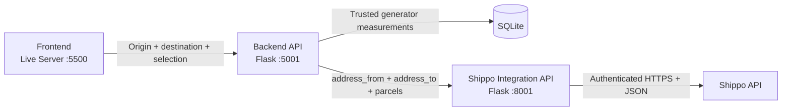

# SoftwareArchitecture_Front_End

Browser frontend for managing customers, hydrogen generators, relationships,
and shipping quotes through the DFSB backend API.

For UI structure, state, API workflows, sequence diagrams, and responsive
architecture, see [SPECIFIC_ARCHITECTURE.md](SPECIFIC_ARCHITECTURE.md).

## Backend Repository

The backend for this project can be found at:
https://github.com/Guiga1993/SoftwareArchitecture_Back_End_API.git

## Current Architecture



The browser communicates only with the backend. It never receives Shippo
credentials and never calls the integration API directly.

## Project Structure

- `index.html` - Semantic document structure and form controls
- `scripts.js` - API clients, table rendering, validation, and UI workflows
- `style.css` - Component styles and responsive layout
- `img/` - Local image assets
- `tests/test_html.py` - HTML structure and accessibility contracts
- `tests/test_javascript.py` - JavaScript syntax and integration contracts
- `requirements-dev.txt` - Pinned frontend test dependencies

## Code Organization

JavaScript declarations are ordered by dependency: configuration, shared
utilities, navigation, searches, API clients, table rendering, domain form
workflows, shipping, and application initialization. Keep DOM event binding at
the end of `scripts.js` and keep IDs in `index.html` synchronized with the
JavaScript and static tests.

CSS follows document structure from global rules through components, tables,
utilities, and responsive overrides. Place new mobile overrides in the final
media-query section.


## How to Run

**Important:** Start the services in dependency order.

1. Start `SoftwareArchitecture_API_External/app.py` on port `8001`.
2. Start `SoftwareArchitecture_Back_End_API/app.py` on port `5001`.
3. Use VS Code Live Server to serve this directory on port `5500`.
4. Open `http://127.0.0.1:5500` in a browser.

## Features

- Responsive layout
- JavaScript-powered interactivity
- Custom styles
- Generator shipping dimensions and weight
- Shipping quotes based on generator selection and quantity
- Per-request origin and destination addresses for shipping quotes
- Create, edit, search, list, and delete workflows for managed records

## Frontend Usage Notes

- The frontend tables (customers, generators, assets) are empty by default when the page loads.
- Data is only shown after the user clicks the **List All** button or performs a search (e.g., by ID or serial number).
- Create and edit operations update the relevant table automatically.
- The pencil action loads a record into its existing form; **Cancel Edit** returns the form to create mode.
- Each section also has a **Clear Table** button, which clears the table in the HTML only (no data is deleted from the database).
- Shipping requests go only to the backend at `http://127.0.0.1:5001`.
- Generator dimensions and weight are displayed read-only and are not submitted;
	the backend loads trusted measurements from SQLite.
- Verify shipping manually by completing both addresses, choosing a generator
	and quantity, and checking success, no-rate messages, and validation errors.

The shipping request contains only origin and destination fields, generator ID,
and quantity. Dimensions and weight remain trusted backend database values.

## Requirements

- Modern web browser (Chrome, Firefox, Edge, Safari)

## HTML Tests

Create and activate a Python virtual environment, then install the test dependencies:

```powershell
python -m venv .venv
& ".\.venv\Scripts\Activate.ps1"
python -m pip install -r requirements-dev.txt
```

Run the complete frontend test suite from the frontend project directory:

```powershell
python -m pytest tests -q
```

## Author

- Guilherme Alves Lima

---