# Frontend Architecture

## 1. Purpose and Scope

`SoftwareArchitecture_Front_End` is a static browser application for managing
customers, hydrogen generators, customer-generator relationships, and shipping
quotes. It is implemented with semantic HTML, CSS, and browser JavaScript and
is normally served by VS Code Live Server at `http://127.0.0.1:5500`.

The frontend owns:

- Tab navigation and accessible form interactions.
- Client-side input checks and inline validation feedback.
- CRUD request construction for the backend API.
- Table rendering, search, create/edit mode, and deletion confirmation.
- A browser-side cache of generator records for shipping selection.
- Read-only shipping measurement previews and local freight feedback.
- Presentation of backend and integration outcomes.

The frontend does not own:

- Persistent data or database access.
- Authoritative validation or uniqueness rules.
- Trusted generator measurements. Displayed values are informative only.
- Shippo credentials, provider calls, carrier selection, or retries.
- Direct communication with `SoftwareArchitecture_API_External`.

## 2. System Context

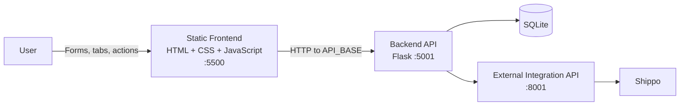

The `apiUrl` resolver in `scripts.js` selects the transport boundary from the
page port. Port `5500` targets the local backend at
`http://127.0.0.1:5001`; every other port uses `/api`, which the containerized
nginx server strips before proxying to `http://backend:5001/`. All browser
network traffic still terminates at the backend. This boundary prevents Shippo
secrets, private service names, and provider-specific payloads from entering
browser requests.

## 3. Static Application Structure

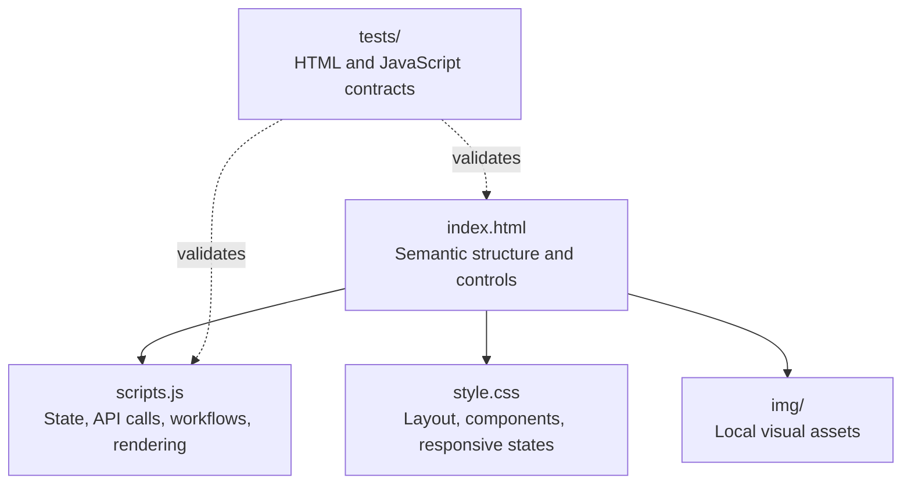

There is no build pipeline, framework runtime, router, package bundle, or
client-side persistence. A page refresh reconstructs state from the document
and subsequent backend reads.

## 4. View Composition

The application uses a single document with four accessible tab panels.

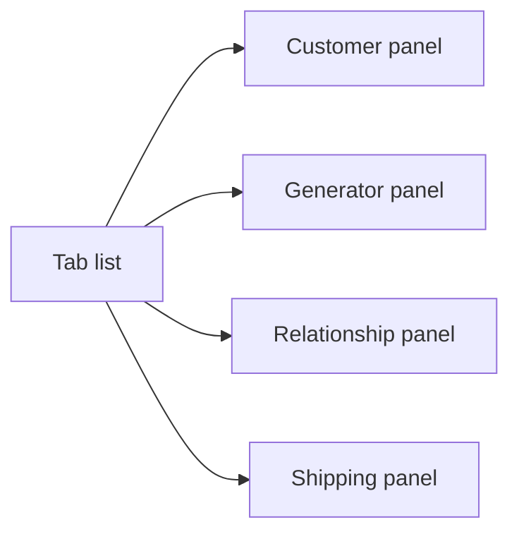

| Panel | Main form | Search key | Result surface |
|---|---|---|---|
| Customers | `customerForm` | Numeric customer ID | `customerTable` |
| Generators | `generatorForm` | Generator serial number | `generatorTable` |
| Relationships | `customerGeneratorForm` | Numeric relationship ID | `customerGeneratorTable` |
| Shipping | `shippingQuoteForm` | Generator selection | `shippingResult` |

Tab buttons use `role="tab"`, `aria-controls`, and keyboard navigation. Arrow
keys move between tabs; Home and End select the first and last tab. Only the
active panel is presented as selected.

## 5. JavaScript Module Organization

Although `scripts.js` is one file, declarations are ordered as cooperating
logical modules:

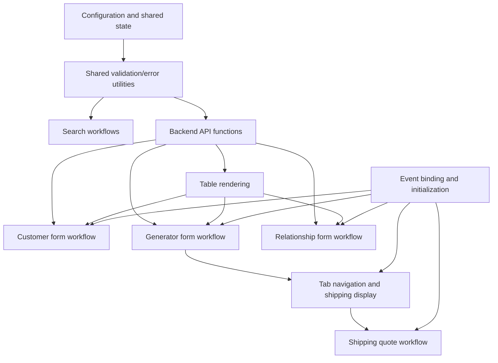

This ordering matters because the file uses global function declarations and a
small shared state object rather than ES modules.

## 6. Client State Model

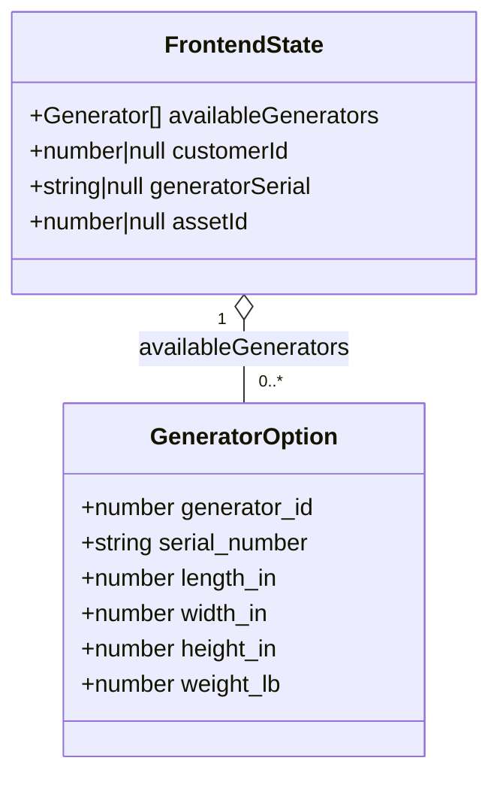

`availableGenerators` supports the shipping selector and measurement preview.
`editState` stores only the identity of the record currently being edited:

- `customerId` identifies a customer update.
- `generatorSerial` preserves the pre-edit serial used by the PUT query.
- `assetId` identifies a relationship update.

The DOM remains the source of current form values. There is no Redux-style
store and no local/session storage.

## 7. Backend API Adapter

| Resource | List/read | Create/update/delete | Encoding |
|---|---|---|---|
| Customer | `GET /customers`, `GET /customer?customer_id=...` | `POST`, `PUT`, `DELETE /customer` | FormData for writes |
| Generator | `GET /hydrogen-generators`, `GET /hydrogen-generator?serial_number=...` | `POST`, `PUT`, `DELETE /hydrogen-generator` | FormData for writes |
| Relationship | `GET /assets`, `GET /asset?asset_id=...` | `POST`, `PUT`, `DELETE /asset` | FormData for writes |
| Shipping | None | `POST /shipping-quote` | JSON |

Single-record keys are URL encoded before being placed in query strings. API
functions decode JSON and return either an entity/result or a normalized error
shape for the workflow layer.

### Customer create example

```http
POST http://127.0.0.1:5001/customer
Content-Type: multipart/form-data

name=Acme Corporation
email=contact@example.com
tx_id=123-45-6789
```

```json
{
  "customer_id": 42,
  "name": "Acme Corporation",
  "email": "contact@example.com",
  "tx_id": "123-45-6789"
}
```

## 8. CRUD Interaction Lifecycle

The three managed domain panels share the same lifecycle.

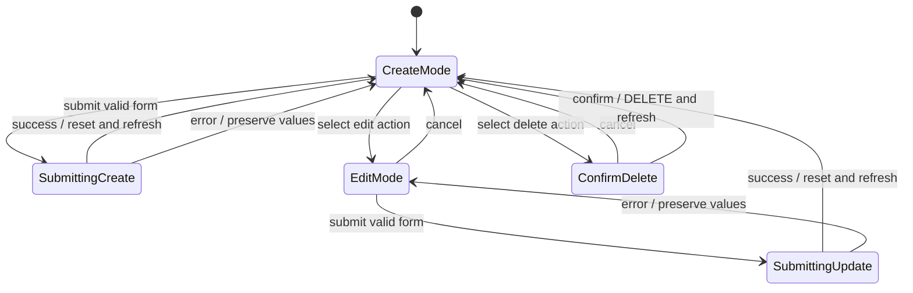

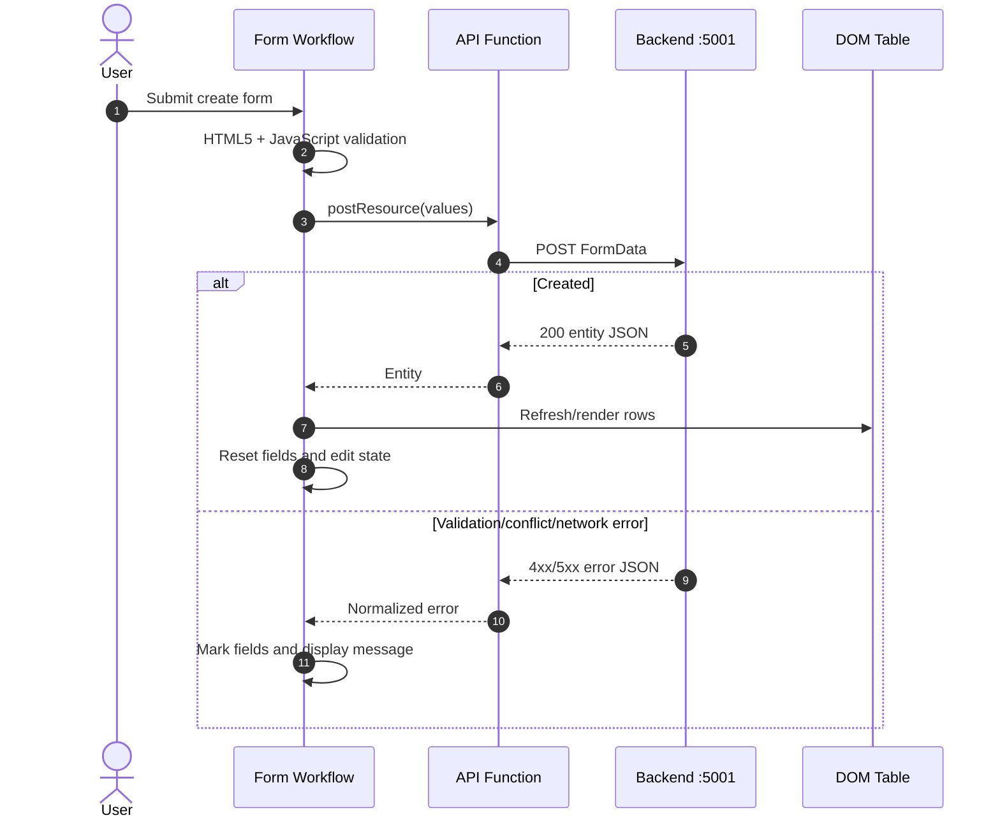

Search replaces the visible table rows with the matching record. **Clear
Table** removes DOM rows only; it never issues DELETE requests. **List All**
performs a new collection request.

## 9. Validation and Error Presentation

Validation is intentionally layered:

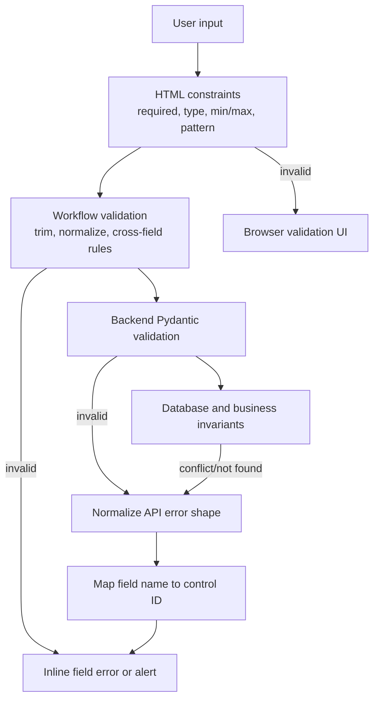

The frontend accepts several backend error representations:

- `{ "message": "..." }`
- A `detail` array with `loc` and `msg` entries.
- A `validation_error` object grouped by body, form, query, or path.

`extractErrorMessage` creates a user-facing summary. `extractRawDetail` retains
structured entries so API field names can be mapped to control IDs and marked
with `.input-error` plus an inline message. Network failures fall back to a
generic alert or the shipping result surface.

Client-side checks improve responsiveness but are not a security boundary. The
backend repeats authoritative schema and business validation.

## 10. Generator Presentation and Shipping Cache

Generator records include trusted dimensions and weight returned by the
backend. The frontend caches those returned records in `availableGenerators` to
populate `shippingGeneratorId` and update read-only fields.

For dimensions sorted from largest to smallest, the preview uses:

$$
\text{length plus girth} = L + 2(W + H)
$$

The UI also shows unit dimensions, unit weight, and quantity-derived shipment
information. These values help the user understand the selection, but the
shipping request deliberately sends only the generator ID and quantity. The
backend reloads physical measurements from SQLite.

## 11. Shipping Quote Flow

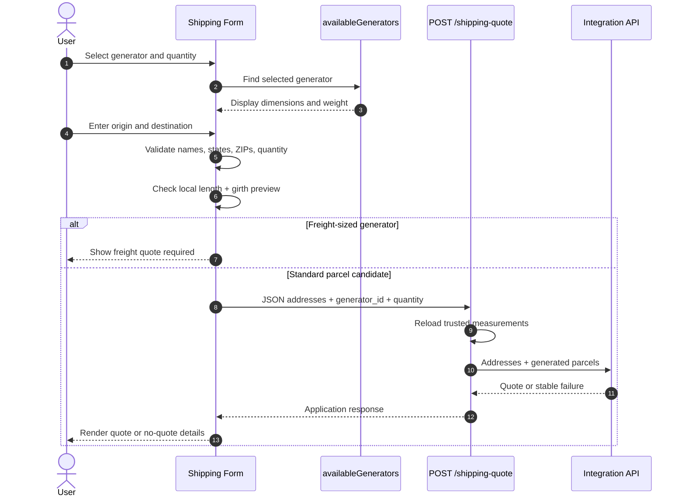

### Request

```json
{
  "origin_name": "West Coast Warehouse",
  "origin_street": "100 Manufacturing Way",
  "origin_city": "Torrance",
  "origin_state": "CA",
  "origin_zip": "90501",
  "customer_name": "Acme Corporation",
  "destination_street": "123 Main Street",
  "destination_city": "Atlanta",
  "destination_state": "GA",
  "destination_zip": "30301",
  "generator_id": 7,
  "generator_quantity": 2
}
```

### Success response

```json
{
  "success": true,
  "message": "Shipping rates available.",
  "carrier": "UPS",
  "service": "Ground",
  "amount": "45.99",
  "currency": "USD",
  "estimated_days": 3,
  "shippo_messages": []
}
```

### No-quote response

```json
{
  "success": false,
  "error_code": "NO_RATES",
  "message": "No shipping rate was available for the supplied shipment.",
  "shippo_messages": [
    {
      "source": "UPS",
      "message": "Parcel is outside this service level's limits."
    }
  ]
}
```

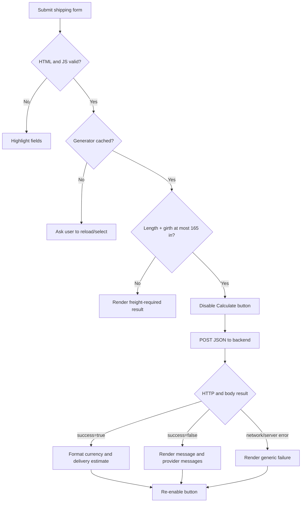

## 12. Rendering Architecture

Table rows are built with DOM APIs. Shared helpers create action buttons and
attach edit/delete handlers. The generator table computes voltage per cell for
display:

$$
\text{voltage per cell} =
\frac{\text{stack voltage}}{\text{number of cells}}
$$

Action buttons have accessible labels. Relationship installation timestamps
are converted to localized dates for display, while edit mode converts them
back to the `YYYY-MM-DD` value expected by a date input.

## 13. CSS and Responsive Architecture

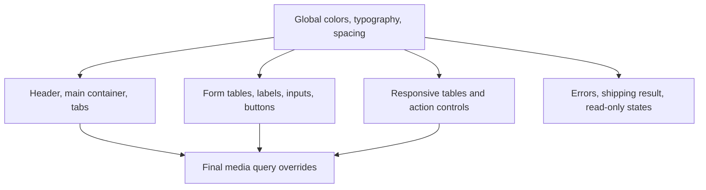

The main content is constrained to a readable desktop width. Tabs use four
equal grid columns on desktop and two columns on smaller screens. Form table
cells stack vertically in the mobile breakpoint, while data tables remain
scrollable so dense records do not overlap.

Stable button and action dimensions reduce layout movement when labels or rows
change. Read-only shipping measurements use a distinct visual state from
editable inputs.

## 14. Accessibility

The application includes:

- Semantic forms, labels, headings, and tables.
- A tablist/tab/tabpanel relationship with ARIA state.
- Keyboard tab switching.
- Accessible labels for icon-style row actions.
- `aria-live` behavior for shipping results.
- Inline validation messages associated visually with fields.
- Native browser constraints as the first validation layer.

Any new control should preserve label association, keyboard operation, focus
visibility, and non-color error communication.

## 15. Startup and Runtime

1. Start `SoftwareArchitecture_API_External` on port `8001`.
2. Start `SoftwareArchitecture_Back_End_API` on port `5001`.
3. Serve this directory with VS Code Live Server on port `5500`.
4. Open `http://127.0.0.1:5500`.

The page itself can render without the APIs, but reads and mutations require
the backend. Shipping additionally requires the integration API and Shippo.

## 16. Test Architecture

Static tests inspect the HTML contract, accessibility hooks, JavaScript syntax,
required endpoint strings, and workflow structure. They do not require a live
browser, backend, or Shippo connection.

```powershell
python -m pytest tests -q
```

Manual verification remains useful for tab keyboard behavior, responsive table
scrolling, create/edit transitions, deletion confirmation, inline errors, and
shipping result presentation.

## 17. Design Consequences

- **Low operational complexity:** no build or package runtime is required.
- **Explicit contracts:** element IDs form an internal interface between HTML,
  CSS, JavaScript, and static tests.
- **Small state surface:** server data is rendered directly, with only edit IDs
  and generator options retained in memory.
- **Defense in depth:** frontend checks improve usability while backend checks
  remain authoritative.
- **Current coupling:** one global script and ID-based DOM access are practical
  at this scale; future growth would justify ES modules and isolated view
  components before introducing a full framework.
